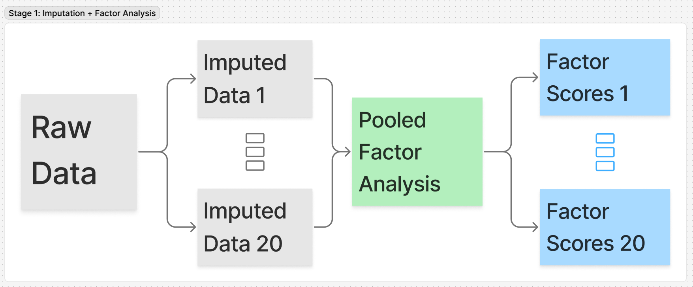
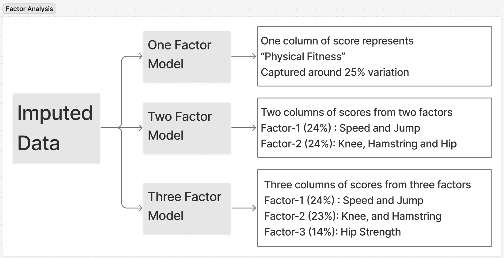
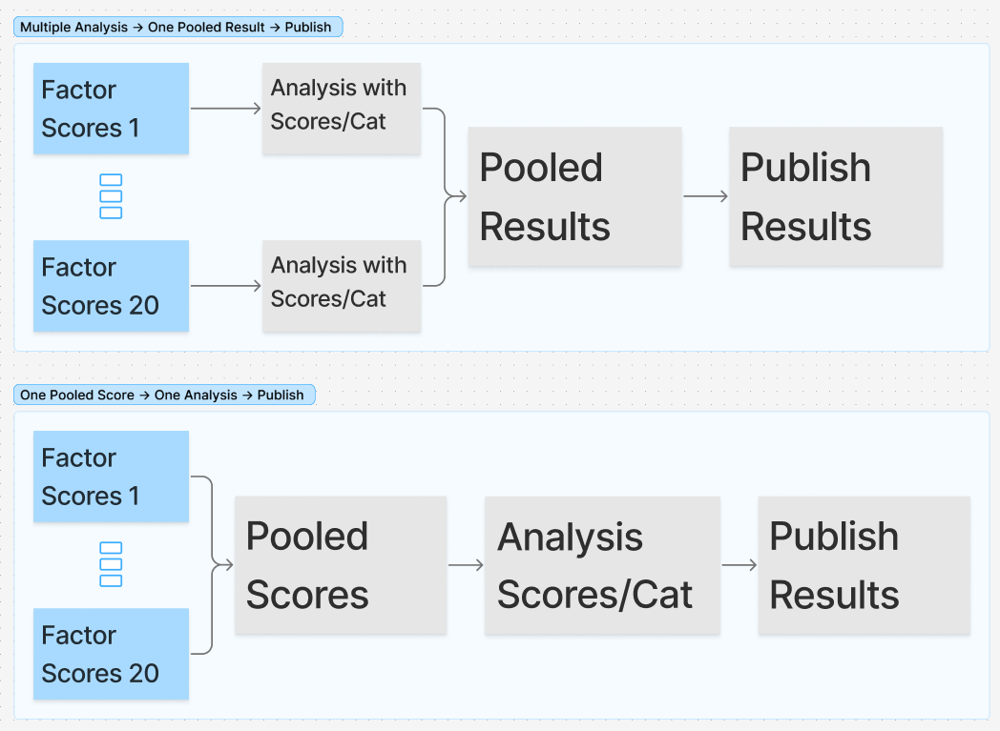

## Data and Results (injury and physical performance test)

```{r}
#| code-summary: setup
#| echo: false
pkgs <- c("tibble", "ggplot2")
for (pkg in pkgs) {
  suppressPackageStartupMessages({
    require(pkg, character.only = TRUE, quietly = TRUE)
  })
}
```

```{r}
#| code-summary: Loading data
source(here::here("code/00-functions.R"))
data <- readRDS(here::here("data/rds/injury-with-pretest.rds"))
season_period <- readr::read_csv(
    file = here::here("data/raw/season-info.csv"), 
    col_types = 'i??'
)

imp <- new.env()
fa <- new.env()

evalq(load(here::here("output/multiple-imputation.rdata")), envir = imp)
evalq(load(here::here("output/factor-analysis.rdata")), envir = fa)

imp_test <- mice::complete(imp$imp_obj, "all", include = TRUE) |> 
    lapply(as_tibble)
```

### Summary of injury data
```{r}
#| code-summary: Injury Summary
am_data <- data |>
  dplyr::select(am_data) |>
  tidyr::unnest(am_data) |>
  dplyr::mutate(dplyr::across(c(incident_type, acute_overuse), tolower))

am_data_during_season <- am_data |>
  dplyr::semi_join(
    season_period,
    by = dplyr::join_by(
      year == year,
      dplyr::between(first_symptom_date, season_start, season_end)
    )
  )

all_time <- am_data |>
  dplyr::summarise(
    athlete = dplyr::n_distinct(athlete_id),
    issues = dplyr::n_distinct(incident_id),
    illness = dplyr::n_distinct(incident_id[incident_type == "illness"]),
    "acute injury" = dplyr::n_distinct(
      incident_id[incident_type == "injury" & acute_overuse == "acute"]
    ),
    "overuse injury" = dplyr::n_distinct(
      incident_id[incident_type == "injury" & acute_overuse == "overuse"]
    ),
    .by = year
  ) |>
  dplyr::rename_with(
    .fn = \(x) paste0("All cases_", x),
    .cols = -year
  )

timeloss_exposure <- am_data |>
  dplyr::summarise(
    "timeloss" = sum(time_loss_days, na.rm = TRUE),
    "match hr" = sum(match_minutes / 60, na.rm = TRUE),
    "training hr" = sum(training_hr_football, na.rm = TRUE),
    .by = c(assigned_date, year)
  ) |>
  dplyr::summarize(
    dplyr::across(
      .cols = c(`timeloss`, `match hr`, `training hr`),
      .fns = mean,
      .names = "average of weekly_{.col}"
    ),
    .by = year
  )

during_season <- am_data_during_season |>
  dplyr::summarise(
    issues = dplyr::n_distinct(incident_id),
    illness = dplyr::n_distinct(incident_id[incident_type == "illness"]),
    "acute injury" = dplyr::n_distinct(
      incident_id[incident_type == "injury" & acute_overuse == "acute"]
    ),
    "overuse injury" = dplyr::n_distinct(
      incident_id[incident_type == "injury" & acute_overuse == "overuse"]
    ),
    .by = year
  ) |>
  dplyr::rename_with(
    .fn = \(x) paste0("During the season_", x),
    .cols = -year
  )

```

```{r}
#| code-summary: Injury summary table
all_time |>
  dplyr::left_join(during_season, by = "year") |>
  gt::gt() |>
  gt::tab_spanner_delim("_", split = 'first', limit = 1) |>
  gt::text_transform(
    fn = stringr::str_to_sentence,
    locations = gt::cells_column_labels()
  ) |>
  gt::opt_vertical_padding(0.25) |>
  gt::opt_table_font(font = "monospace") |> 
  gt::tab_options(table.width = "100%")
```

```{r}
#| code-summary: Summary of timeloss days and exposure
all_time |>
  dplyr::select(1:2) |>
  dplyr::rename_with(\(x) gsub("All cases", "distinct", x)) |>
  dplyr::left_join(timeloss_exposure, by = "year") |>
  gt::gt() |>
  gt::tab_spanner_delim("_") |>
  gt::text_transform(
    fn = stringr::str_to_sentence,
    locations = list(
      gt::cells_column_labels(),
      gt::cells_column_spanners()
    )
  ) |>
  gt::opt_vertical_padding(0.25) |>
  gt::opt_table_font(font = "monospace") |>
  gt::fmt_number(gt::starts_with("average")) |> 
  gt::tab_options(table.width = "100%")

```


```{r}
#| code-summary: Test summary

fa_vars <- c(
  "sprint_20m",
  "sprint_30m",
  "sprint_40m",
  "agility_left",
  "agility_right",
  "cmj_total",
  "ankle_jump_left",
  "ankle_jump_right",
  "max_power_left",
  "max_power_right",
  "max_force_left",
  "max_force_right",
  "hamstring_left",
  "hamstring_right",
  "hip_squeeze_0_left",
  "hip_squeeze_0_right",
  "hip_pull_0_left",
  "hip_pull_0_right"
)
conti_vars <- c('weight_fp', 'age')

get_summary <- function(x) {
  tibble::tibble(
    N = length(x),
    Missing = sum(is.na(x)),
    Percent = Missing / N,
    Mean = mean(x, na.rm = TRUE),
    SD = sd(x, na.rm = TRUE),
    Median = median(x, na.rm = TRUE),
    IQR = IQR(x, na.rm = TRUE)
  )
}

test_data <- data |>
  dplyr::select(test_data) |>
  tidyr::unnest(test_data)

test_summary <- test_data |>
  dplyr::select(year, age, leg_length_malleolus:hip_pull_0_right) |>
  tidyr::pivot_longer(cols = -year) |>
  dplyr::reframe(get_summary(value), .by = c(year, name))
```

```{r}
#| code-summary: Test summary table
test_summary_table <- test_summary |>
  dplyr::group_by(year) |>
  dplyr::group_split() |>
  setNames(unique(test_summary$year)) |>
  purrr::map(\(.dta) {
    .year <- unique(.dta$year)
    .dta |>
      dplyr::select(-year) |> 
      gt::gt(rowname_col = 'name', groupname_col = "year") |>
      gt::fmt_number(columns = matches("Percent|Mean|SD|Median|IQR")) |>
      gt::fmt_percent(columns = matches("Percent")) |> 
      gt::cols_merge(c(Missing, N), pattern = "{1}/{2}") |>
      gt::cols_merge_n_pct(col_n = "Missing", col_pct = "Percent") |>
      gt::cols_merge_uncert(col_val = "Mean", col_uncert = "SD") |>
      gt::cols_merge_n_pct(col_n = "Median", col_pct = "IQR") |>
      gt::cols_label(Mean = "Mean ± SD", Median = "Median (IQR)") |>
      gt::tab_spanner_delim("_") |>
      gt::sub_missing() |>
      gt::opt_vertical_padding(0.25) |>
      gt::opt_table_font(font = "monospace") |>
      gt::tab_stubhead(glue::glue("Year: {.year}")) |> 
      gt::tab_style(
        style = gt::cell_text(color = "red"),
        locations = list(
          gt::cells_stub(rows = !name %in% c(fa_vars, conti_vars)),
          gt::cells_body(rows = !name %in% c(fa_vars, conti_vars))
        )
      ) |>
      gt::tab_options(table.width = "100%")
  })

```

::: panel-tabset
```{r}
#| code-summary: Test summary print
#| results: asis
purrr::iwalk(
    test_summary_table,
    function(.tbl, .name) {
        cat(glue::glue("#### {.name}\n\n\n"))
        print(.tbl)
        cat("\n\n")
    }
)
```
:::

## Missing test data and multiple imputation
{width="100%"}

- Multiple imputation gives multiple version (in our case, I have used 20) of complete dataset imputed based on other variables which are not missing.
- Only physical performance test (PPT) variables with no more than 60% missing were used in each years were used for the analysis (the variables in red of above table were not used)
- Only using the selected PPT variables, a pooled factor analysis was performed and scores were calculated for each athlete in all 20 imputed datasets.
- The scores were used as continuous measure of underlying factor (for example physical performance) and were also categorized into 3 equal parts (using quantiles) and labelled as high, medium, low. 


## Factor Analysis

### What factor analysis does?

**Factor Analysis: **

- is a method used to group related physical tests into a smaller number of meaningful factors
- identifies underlying abilities (e.g. speed, strength, hip function) that explain why some tests are correlated
- helps summarize complex test batteries into clear, interpretable scores


### Why factor analysis fits this study

- Many of the physical tests measure overlapping aspects of performance
- Treating each test variables separately would repeat the same information and over‑emphasize sprint measures
- Here, factor analysis:
    - Reduces repetition of similar tests
    - Identifies distinct physical capacities
    - Estimate scores that better reflect true performance in identified factor domain

### One vs multiple factors in factor analysis

#### One-factor model
- Factor analysis can be used to identify **one or more underlying factors** from test data
- These factors are identified by using the **shared information across all tests**
- If the data reflect **one true underlying** ability:
    - A **1‑factor model** may be sufficient
    - This single factor will typically show **strong correlations with most test variables**
    - Example: a general **overall physical performance** score
- If the data reflect **more than one underlying ability**:
    - A **1‑factor model may not capture all available information**
    - Important differences between types of performance may be lost

#### Multiple factor model
- Using **more than one factor** allows the data to:
    - Separate **different physical performance domains**
    - Represent abilities that are related but not identical
- Example: 
    - One factor may reflect being **good in speed and jumping tasks**
    - Another factor may reflect being **good in force and power tasks**
    - An athlete may perform well in one domain but not the other which leads to different types of injury risk
- In this case:
    - Multiple‑factor models provide a **more detailed meaningful description of performance**
    - The factors identified may differ from the single factor obtained from a 1‑factor model

### Factor analysis with 1-3 factors model

{width="100%"}

#### Factor and Factor Loadings

Loading are weights that indicate how much each test variable contributes to the factor.
- A test variable with a high loading on a factor is strongly associated with that factor and contributes more to the factor score.
- A test variable with a low loading on a factor is weakly associated with that factor and contributes less to the factor score.
- The factor score for each athlete is calculated by multiplying their test variable values by the corresponding factor loadings and summing these products across all test variables.


::: panel-tabset

##### Plots

```{r}
#| code-summary: Factor loadings plot
fa_loadings_plot <- fa$fa_loadings_df |> 
    dplyr::filter(model %in% glue::glue("comp{1:3}_model")) |>
    dplyr::group_by(model) |>
    dplyr::group_split() |>
    purrr::map(\(.dta) {
        .dta |>
            ggplot(aes(y = variable, x = loading, fill = factor)) +
            geom_col(position = position_stack()) +
            facet_grid(
                cols = vars(model),
                labeller = labeller(model = c(
                    comp1_model = "1 Factor Model",
                    comp2_model = "2 Factor Model",
                    comp3_model = "3 Factor Model"
                ))
            ) +
            scale_fill_manual(
                values = c(
                    'steelblue', 
                    'cadetblue', 'darkseagreen', 
                    'skyblue3', 'palegreen3', 'burlywood'
                ),
                guide = guide_legend(nrow = 1)
            ) +
            labs(x = "Factor loading", y = NULL, fill = "Factor") +
            theme(
                legend.position = "bottom",
                legend.justification = "left"
            )
    })
names(fa_loadings_plot) <- glue::glue("{1:3} Factor Model")
```

::: panel-tabset

###### 1 Factor Model

```{r}
#| results: asis
#| out-width: "90%"
#| fig-asp: 0.9
#| echo: false
fa_loadings_plot[[1]]
```

In the 1-factor model, all test variables have moderate to high loadings on the single factor, indicating that they all contribute to a this one factor (lets call it general physical performance factor). Although all variables have some contribution to the factor, sprint and jump related variables have the highest loadings, suggesting that the factor is most strongly associated with sprinting and jumping performance.


###### 2 Factor Model

```{r}
#| results: asis
#| out-width: "90%"
#| fig-asp: 0.9
#| echo: false
fa_loadings_plot[[2]]
```

In the 2-factor model, the first factor has high loadings on sprint and jump related variables, while the second factor has high loadings on force and power related variables. This suggests that the first factor may represent a speed and power domain of physical performance, while the second factor may represent a strength and force domain. 

When using 2-factor model and using scores from second factor, we can identify athletes who are good in force and power related tasks but not in sprint and jump related tasks which may be missed if we use scores from 1-factor model.

###### 3 Factor Model

```{r}
#| results: asis
#| out-width: "90%"
#| fig-asp: 0.9
#| echo: false
fa_loadings_plot[[3]]
```

In the 3-factor model, we captured yet another domain of physical performance related to hip function. In this model, the first factor has high loadings on sprint and jump related variables, the second factor has high loadings on hip squeeze and pull related variables, which in the new dimension of physical performance related to hip function, and the third factor has high loadings on force and power related variables. This suggests that the first factor may represent a speed and power domain of physical performance, the second factor may represent a hip function domain, and the third factor may represent a strength and force domain. 

When using 3-factor model, we can identify athletes who are good in hip function related tasks but not in sprint and jump related tasks or force and power related tasks which may be missed if we use scores from 1-factor model or 2-factor model.

:::

##### Important Variables
```{r}
#| code-summary: Factors identified by the factor analysis
fa$fa_loading_group_table |>
  dplyr::filter(model %in% glue::glue("comp{1:3}_model")) |>
  gt::gt(rowname_col = "factor", groupname_col = "model") |>
  gt::cols_label(variable = "Factor loadings") |>
  gt::tab_style(
    style = gt::cell_text(align = "left", font = "monospace"),
    location = gt::cells_body()
  ) |>
  gt::tab_style(
    style = gt::cell_text(weight = "600", align = "right"),
    location = gt::cells_stub()
  ) |>
  gt::tab_style(
    style = gt::cell_text(weight = "900", align = "left"),
    location = gt::cells_row_groups()
  ) |>
  gt::text_transform(
    fn = \(x) {
      glue::glue(
        gsub("comp(.)_model", "\\1 Factor Model", x[[1]]),
        " (Variance explained: {fa$fa_vac[x[[1]]]})"
      )
    },
    locations = gt::cells_row_groups()
  ) |>
  gt::tab_options(table.width = "100%", column_labels.font.weight = "bold")
```

:::

#### Factor, Scores, and Physical Fitness Test

When we suse 1, 2, or 3 factor model, we can calculate scores for each athlete based on the factor loadings and their test variable values. These scores represent the athlete's performance in the underlying factor domain identified by the factor analysis. For example, in the 1-factor model, the score represents the athlete's overall physical performance. In the 2-factor model, the first factor score represents the athlete's performance in the speed and power domain, while the second factor score represents the athlete's performance in the strength and force domain.

In the following plots, we can see how the scores from each factor model relate to the original test variables and the performance categories (high, medium, low) based on the scores. This helps us understand how well the factor scores capture the information from the original test variables and how they differentiate between athletes with different levels of performance.

::: panel-tabset
##### 1-factor model

Here, we can see high correlation between scores from 1-factor model and sprint and jump related variables which is expected as these variables had the highest loadings on the factor. But for varialbes like `hip_squeeze_0_left` and `max_power_left`, the correlation with scores from 1-factor model is weaker which is also expected as these variables had lower loadings on the factor.

```{r}
#| code-summary: Scores vs variables in 1-factor model
#| fig-asp: 0.5
#| out-width: "100%"
fa$fa_scores$comp1_model$scores_pooled |>
  imp$scaler(direction = "unscale") |>
  dplyr::select(
    sprint_40m,
    hip_squeeze_0_left,
    max_power_left,
    starts_with("score_"),
    starts_with("cat_")
  ) |>
  tidyr::pivot_longer(
    cols = -c(starts_with("score_"), starts_with("cat_")),
    names_to = "variable"
  ) |>
  tidyr::pivot_longer(
    cols = c(starts_with("score_"), starts_with("cat_")),
    names_to = c(".value", "factor"),
    names_pattern = "(score|cat)_(\\d)"
  ) |>
  dplyr::mutate(factor = glue::glue("Factor {factor}")) |> 
  ggplot(aes(y = score, x = value, color = cat)) +
  geom_point(na.rm = TRUE, alpha = 0.5, stroke = 0) +
  geom_point(na.rm = TRUE, shape = 21, stroke = 0.25) +
  facet_grid(
    cols = vars(variable),
    rows = vars(factor),
    scales = "free_x"
  ) +
  labs(
    x = "Test variable value",
    y = "Factor score",
    color = "Performance category"
  ) +
  scale_color_brewer(palette = "Set1", direction = -1) +
  theme(
    legend.position = "bottom",
    legend.justification = "left"
  )
```

##### 2-factor model

In this model, we have two factors scores, the first one has high correlation with sprint and jump related variables and the second one has high correlation with force and power related variables. This is expected as these variables had the highest loadings on their respective factors. For varialbes like `hip_squeeze_0_left`, the correlation with scores from both factors is weaker which is also expected as this variable had lower loadings on both factors. In this model, when we use the second score, we are representing the athlete's performance in the strength and force domain which is not captured by the first score from 1-factor model. This allows us to identify athletes who are good in force and power related tasks but not in sprint and jump related tasks which may be missed if we use scores from 1-factor model.

This is important when we want to analyze injuries that is more related to force and power related tasks as we can identify athletes who are at risk of such injuries based on their scores from the second factor in the 2-factor model which may not be possible if we use scores from 1-factor model.

```{r}
#| code-summary: Scores vs variables in 2-factor model
#| fig-asp: 0.75
#| out-width: "100%"
fa$fa_scores$comp2_model$scores_pooled |>
  imp$scaler(direction = "unscale") |>
  dplyr::select(
    sprint_40m,
    hip_squeeze_0_left,
    max_power_left,
    starts_with("score_"),
    starts_with("cat_")
  ) |>
  tidyr::pivot_longer(
    cols = -c(starts_with("score_"), starts_with("cat_")),
    names_to = "variable"
  ) |>
  tidyr::pivot_longer(
    cols = c(starts_with("score_"), starts_with("cat_")),
    names_to = c(".value", "factor"),
    names_pattern = "(score|cat)_(\\d)"
  ) |>
  dplyr::mutate(factor = glue::glue("Factor {factor}")) |> 
  ggplot(aes(y = score, x = value, color = cat)) +
  geom_point(na.rm = TRUE, alpha = 0.5, stroke = 0) +
  geom_point(na.rm = TRUE, shape = 21, stroke = 0.25) +
  facet_grid(
    cols = vars(variable),
    rows = vars(factor),
    scales = "free_x"
  ) +
  labs(
    x = "Test variable value",
    y = "Factor score",
    color = "Performance category"
  ) +
  scale_color_brewer(palette = "Set1", direction = -1) +
  theme(
    legend.position = "bottom",
    legend.justification = "left"
  )
```

##### 3-factor model

In the 3-factor model, there is additional dimension captured by the second factor which is related to hip function. In this model, the second factor has high correlation with hip squeeze and pull related variables. This is expected as these variables had the highest loadings on the second factor. When we use the second score from this model, we are representing the athlete's performance in the hip function domain which is not captured by the any of the scores in 1-factor model or 2-factor model. This allows us to identify athletes who are good in hip function related tasks and is important when analyzing injuries that is more related to hip function as we can identify athletes who are at risk of such injuries.

```{r}
#| code-summary: Scores vs variables in 3-factor model
#| fig-asp: 1
#| out-width: "100%"
fa$fa_scores$comp3_model$scores_pooled |>
  imp$scaler(direction = "unscale") |>
  dplyr::select(
    sprint_40m,
    hip_squeeze_0_left,
    max_power_left,
    starts_with("score_"),
    starts_with("cat_")
  ) |>
  tidyr::pivot_longer(
    cols = -c(starts_with("score_"), starts_with("cat_")),
    names_to = "variable"
  ) |>
  tidyr::pivot_longer(
    cols = c(starts_with("score_"), starts_with("cat_")),
    names_to = c(".value", "factor"),
    names_pattern = "(score|cat)_(\\d)"
  ) |>
  dplyr::mutate(factor = glue::glue("Factor {factor}")) |> 
  ggplot(aes(y = score, x = value, color = cat)) +
  geom_point(na.rm = TRUE, alpha = 0.5, stroke = 0) +
  geom_point(na.rm = TRUE, shape = 21, stroke = 0.25) +
  facet_grid(
    cols = vars(variable),
    rows = vars(factor),
    scales = "free_x"
  ) +
  labs(
    x = "Test variable value",
    y = "Factor score",
    color = "Performance category"
  ) +
  scale_color_brewer(palette = "Set1", direction = -1) +
  theme(
    legend.position = "bottom",
    legend.justification = "left"
  )
```


:::

### Factor analysis: 1-factor model (Physical Fitness Model)

{width="100%"}

#### Incidence (overall and by injury type)

The following analysis is based on "one pooled score" approach illustrated in the figure above. Here, the scores from all 20 imputed datasets are pooled into one single score for each athlete and then categorized into three categories (high, medium, low) based on quantiles.

```{r}
#| code-summary: Calculating incidence by fitness level from 1-factor model
data_fa1 <- am_data |> 
  dplyr::select(year, athlete_id, teams, gender:period, body_part, injury_type) |> 
  dplyr::left_join(
    fa$fa_scores$comp1_model$scores_pooled |> 
      dplyr::select(athlete_id, year, score = score_1, fitness_cat = cat_1), 
      by = dplyr::join_by(year, athlete_id)
  ) |> 
  dplyr::semi_join(
    season_period, 
    by = dplyr::join_by(
      year == year, 
      dplyr::between(first_symptom_date, season_start, season_end)
    )
  ) |> 
  dplyr::filter(dplyr::n() > 1, .by = c(year, athlete_id))

injury_data_fa1 <- dplyr::bind_rows(
  data_fa1 |> 
    dplyr::summarize(
      n_incident = dplyr::n_distinct(incident_id),
      exposure_hr = sum(match_minutes / 60, na.rm = TRUE) + sum(training_hr_football, na.rm = TRUE),
      total_time_loss = sum(time_loss_days, na.rm = TRUE),
      score = dplyr::first(score),
      injury_type = "Overall",
      .by = c(year, athlete_id, fitness_cat)
  ),
data_fa1 |> 
  dplyr::summarize(
    n_incident = dplyr::n_distinct(incident_id),
    exposure_hr = sum(match_minutes / 60, na.rm = TRUE) + sum(training_hr_football, na.rm = TRUE),
    total_time_loss = sum(time_loss_days, na.rm = TRUE),
    score = dplyr::first(score),
    fitness_cat = dplyr::first(fitness_cat),
    .by = c(year, athlete_id, injury_type, fitness_cat)
  )
) |> dplyr::filter(exposure_hr > 1) |> 
  dplyr::mutate(
    injury_type = as.factor(injury_type) |> 
      forcats::fct_relevel("Overall", after = Inf)
  )
 
incidence_fa1 <- injury_data_fa1 |> 
  dplyr::reframe(
    get_incidence(n_incident, exposure_hr),
    .by = c(year, athlete_id, score, injury_type, fitness_cat)
  )
```

::: panel-tabset

##### Incidence by fitness category

```{r}
#| code-summary: Incidence from 1-factor model
#| fig-asp: 0.8
#| fig-width: 7
#| out-width: "100%"
incidence_fa1 |> 
  dplyr::filter(!is.na(injury_type), injury_type != 'Pre existing') |>
  ggplot(aes(x = factor(year), y = incidence, color = fitness_cat)) +
  facet_wrap(
    facets = vars(injury_type),
    scales = "free"
  ) +
  geom_point(
    position = position_jitterdodge(jitter.width = 0.2, dodge.width = 0.5),
    alpha = 0.25,
    stroke = 0.25
  ) +
  stat_summary(
    fun.data = mean_se, 
    geom = "crossbar", 
    position = position_dodge(width = 0.5), 
    width = 0.35,
    alpha = 0.25,
    aes(fill = fitness_cat)
  ) +
  scale_y_continuous(breaks = scales::breaks_extended(7)) +
  scale_color_brewer(palette = "Set1", direction = -1) +
  scale_fill_brewer(palette = "Set1", direction = -1) +
  labs(
    x = "Year", 
    y = "Injury incidence (per 1000 hr)",
    color = "Physical fitness category",
    fill = "Physical fitness category"
  ) +
  theme(
    legend.position = "bottom",
    legend.justification = "left",
    panel.grid.major.x = element_blank()
  )

```

##### Incidence vs scores

```{r}
#| code-summary: Incidence vs scores from 1-factor model
#| fig-asp: 0.8
#| fig-width: 7
#| out-width: "100%"
incidence_fa1 |>
  dplyr::filter(!is.na(injury_type), injury_type != 'Pre existing') |>
  ggplot(aes(x = score, y = incidence, color = fitness_cat)) +
  geom_point(na.rm = TRUE, alpha = 0.5, stroke = 0) +
  geom_point(na.rm = TRUE, shape = 21, stroke = 0.5) +
  geom_text(
    aes(label = athlete_id),
    check_overlap = TRUE,
    vjust = 1.5,
    size = 1.75,
    show.legend = FALSE
  ) +
  facet_grid(
    rows = vars(injury_type),
    cols = vars(year),
    scales = "free"
  ) +
  scale_color_brewer(palette = "Set1", direction = -1) +
  labs(
    x = "Physical fitness score (1-factor model)", 
    y = "Injury incidence (per 1000 hr)",
    color = "Physical fitness category"
  ) +
  theme(
    legend.position = "bottom",
    legend.justification = "left"
  )
```

:::

#### Modelling incidence using scores and fitness categories from 1-factor model

##### Modelling incidence vs scores from 1-factor model
Here, the continuous scores from 1-factor model are used as a predictor in the model to analyze the relationship between physical fitness and injury incidence. This allows us to see how changes in the physical fitness score are associated with changes in injury incidence, also accounting for other factors such as year and injury type.

```{r}
#| code-summary: Modelling incidence vs scores from 1-factor model
model_data_fa1 <- incidence_fa1 |> 
  dplyr::filter(!is.na(injury_type), injury_type != 'Pre existing')

model_fa1 <- glm(
  formula = total_injury ~ year + injury_type + score + year * injury_type + year * score + 
    offset(log(exposure)),
  data = model_data_fa1,
  family = poisson(link = "log")
)
```


::: panel-tabset

##### Marginal Effects
```{r}
#| code-summary: Marginial means from model with scores from 1-factor model
emmeans::emmeans(
  emmeans::ref_grid(
    model_fa1,
    at = list(
      score = seq(-3, 3, 0.25),
      year = c(2020, 2021, 2023, 2024),
      exposure = 1000
    )
  ),
  ~ score * year * injury_type,
  type = "response"
) |>
  as_tibble() |> 
  ggplot(aes(x = score, y = rate, color = injury_type)) +
  geom_line() +
  facet_wrap(facets = vars(year))
```

The results shows that the injury incidence tends to decrease with physical fitness (score from 1-factor model) for overall injuries and by injury type, however this is only for the year 2020 and 2021. For the year 2023 and 2024, we observed rather reversed relationship where the injury incidence tends to increase with physical fitness (score from 1-factor model) for overall injuries and by injury type. 

This is a bit unexpected and may be due to several reasons. One possible reason is that the relationship between physical fitness and injury incidence may have changed over time due to changes in training practices, injury prevention strategies, or other factors that may have influenced the relationship between physical fitness and injury incidence in these years. Another possible reason is that there may be some confounding factors that are influencing the relationship between physical fitness and injury incidence in these years which are not captured by the model.

Maybe using multiple factor model and using scores from different factors may provide more insights into the relationship between physical fitness and injury incidence as it can capture different dimensions of physical fitness which may have different relationships with injury incidence.


##### Model Summary
```{r}
#| code-summary: Summary of model with scores from 1-factor model
summary(model_fa1)
```

:::

##### Modelling incidence vs fitness categories from 1-factor model
Here, the fitness categories (high, medium, low) based on scores from 1-factor model are used as a predictor in the model to analyze the relationship between physical fitness and injury incidence. This allows us to see how being in different fitness categories is associated with changes in injury incidence, also accounting for other factors such as year and injury type.

```{r}
#| code-summary: Modelling incidence vs fitness categories from 1-factor model
model2_fa1 <- glm(
  formula = total_injury ~ year * injury_type * fitness_cat + offset(log(exposure)),
  data = model_data_fa1,
  family = poisson(link = "log")
)
```

::: panel-tabset

##### Marginal Effects

```{r}
#| code-summary: Marginial means from model with fitness categories from 1-factor model
emm <- emmeans::emmeans(
  emmeans::ref_grid(
    model2_fa1,
    at = list(
      year = c(2020, 2021, 2023, 2024),
      exposure = 1000
    )
  ),
  ~ fitness_cat * year * injury_type,
  type = "response"
)
```

```{r}
#| code-summary: Plotting marginial means from model with fitness categories from 1-factor model
emm |>
  as_tibble() |> 
  ggplot(aes(x = factor(year), y = rate, color = fitness_cat)) +
  geom_pointrange(
    aes(ymin = asymp.LCL, ymax = asymp.UCL),
    position = position_dodge(width = 0.5),
    shape = 23, fill = "whitesmoke",
    size = 0.25, linewidth = 0.5
  ) +
  facet_wrap(facets = vars(injury_type)) +
  scale_color_brewer(palette = "Set1", direction = -1) +
  labs(
    x = "Year", 
    y = "Injury incidence (per 1000 hr)",
    color = "Fitness category"
  ) +
  theme(
    legend.position = "bottom",
    legend.justification = "left"
  )
```

```{r}
#| code-summary: Pairwise comparison of fitness categories
#| fig-asp: 0.5
pairs(emm, by = c("year", "injury_type"), adjust = "tukey") |> 
  confint() |>
  as_tibble() |> 
  ggplot(aes(x = ratio, y = contrast)) +
  geom_pointrange(
    aes(xmin = asymp.LCL, xmax = asymp.UCL),
    position = position_dodge2(width = 0.6),
    shape = 23, fill = "whitesmoke",
    size = 0.25, linewidth = 0.5
  ) +
    geom_vline(xintercept = 1, linetype = "dashed", color = "grey50") +
  facet_grid(rows = vars(year), cols = vars(injury_type)) +
  scale_color_brewer(palette = "Set1", direction = -1) +
  labs(
    x = "Incidence rate ratio", 
    y = NULL
  ) +
  theme(
    legend.position = "bottom",
    legend.justification = "left"
  )
```


##### Model Summary

```{r}
#| code-summary: Summary of model with fitness categories from 1-factor model
summary(model2_fa1)
```

:::

